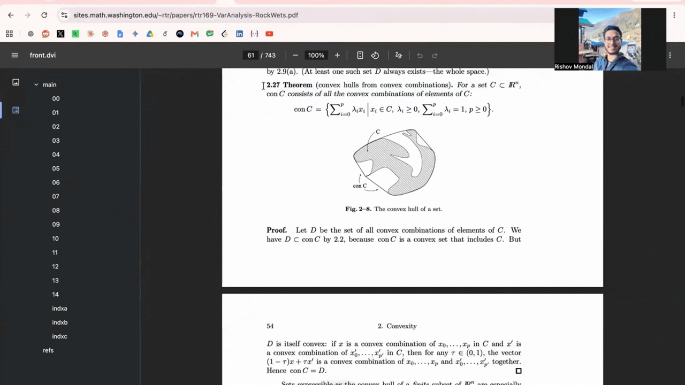
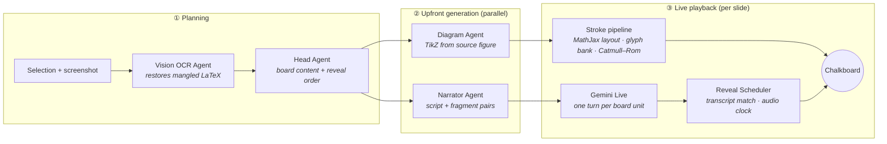

<div align="center">

# SEMINAR

### Synchronization Engine for Mathematical Illustration, Narration, and Reasoning

**Highlight any piece of mathematics in your browser. Watch it become a narrated, hand-drawn chalkboard seminar.**

[](#citation)
[](LICENSE)
[](#install)
[](https://ai.google.dev/)



▶️ **[Watch the full demo with narration (2.5 min)](https://www.youtube.com/watch?v=h4DWbmh2Nb0)**

</div>

---

Reading a dense mathematical paper is hard. Listening to one read aloud by a text-to-speech engine is worse: *"x belonging to blackboard-bold R superscript n."* A good lecturer does something neither can. They **speak the mathematics naturally** while **writing it on the board, stroke by stroke, in step with what they say**.

SEMINAR is a Chrome extension that recreates that experience for any mathematics you can select on a web page.

## ✨ Features

- 🎙️ **Mathematics spoken like a mathematician.** $f^{-1}(x)$ is read as *"f inverse of x"*, not *"f to the power of minus one"*.
- ✍️ **Everything is hand-drawn.** Every prose letter and equation symbol is drawn stroke by stroke from a glyph bank, with no fonts involved. Symbol placement comes from MathJax's own layout engine.
- 🔁 **Speech and writing stay in sync.** Each phrase is written as it is spoken, gated on the actual audio playback clock rather than on network timing. The board never runs ahead of the voice.
- 📐 **Diagrams from the source.** Figures in the selected material are re-sketched as TikZ and drawn onto the board.
- 🙋 **Ask a question mid-seminar.** Click the orb, ask aloud, and get a spoken answer grounded in the current slide.
- ✏️ **Fully editable.** Every slide, equation, and line of narration can be edited before or during playback.
- 🗂️ **Per-tab isolation.** Each browser tab keeps its own seminar.

## 🚀 Install

SEMINAR is not on the Chrome Web Store yet. Load it unpacked:

1. **Clone the repository**
   ```bash
   git clone https://github.com/rishov16/Seminar_Neural.git
   ```
2. Open `chrome://extensions` and switch on **Developer mode** (top right).
3. Click **Load unpacked** and select the cloned folder.
4. Get a free **Gemini API key** from [Google AI Studio](https://aistudio.google.com/).
5. Click the SEMINAR toolbar icon to open the side panel, then paste your key into **Settings** (⚙️).

There is no build step: the extension is plain ES modules, and all libraries are vendored in `vendor/`. Chrome 116 or newer is required for the Side Panel API.

## 🎓 Usage

| From a web page | From pasted text |
|---|---|
| Highlight mathematical text, right-click, and choose **Build Seminar from Selection**. | Click the ✏️ icon in the player bar, paste text or LaTeX, and click **Load & Generate**. |

Then press **▶ Play**. Use the **Slides** sidebar to jump between slides or edit board content, and the **Narrator Notes** tab to edit or regenerate what is spoken.

## 🧠 How it works



**The board is the source of truth.** The Head Agent decides only *what goes on the board*. The Narrator Agent then narrates that exact content, so the script cannot drift from the notation shown.

**Fragment pairs.** For each board line, the Narrator emits pairs of *(spoken phrase, slice of board text)*. A reconstruction check requires that the slices concatenate back to the original line, character for character. Any violation falls back to a single fragment. For example:

| Spoken | Written |
|---|---|
| *"consider a vector a in n-dimensional real space"* | Consider a vector $a$ in $\mathbb{R}^n$ |
| *"and another vector b in n-dimensional real space"* | and another vector $b$ in $\mathbb{R}^n$. |
| *"their inner product is defined as gamma, equal to a transpose b"* | Their inner product is defined as $\gamma = a^T b$. |

**Gated reveal.** Gemini Live streams audio faster than real time. SEMINAR therefore reveals a fragment only when the audio player's own clock reaches the point where that fragment's speech ends. The trigger is not the arrival of the transcript message. If a fragment is never confirmed, it is force-revealed when the turn completes, so errors can only make a reveal *late*, never early. The pen also applies back-pressure: the next turn waits until writing has caught up.

## 📊 Evaluation

These are preliminary component checks on small fixture sets. They are sanity checks, not benchmarks. See [`evals/`](evals/) for scripts and raw results, including sample narration audio in [`evals/narration/results/audio/`](evals/narration/results/audio/).

| Component | Result |
|---|---|
| Fragmentation (8 slides, 10 board units) | 8/8 pass reconstruction checks; 7/10 units split into ≥ 2 fragments |
| Narration quality (LLM judge, 1–5) | Faithfulness 4.13 · naturalness 4.25 · notation accuracy 4.63 |
| Intelligibility (TTS → ASR word error rate) | 14.3% on 1 slide (the rest were blocked by API quota) |
| Stroke shape (DTW vs. MathWriting human ink, 29 glyphs) | 1.34× human-to-human variability |
| Reveal timing (5 live runs × 4 boundaries) | At or ahead of the proportional audio position in 20/20 crossings |

## 🔒 Privacy

SEMINAR has no server of its own. It talks directly to the **Google Gemini API** using **your** API key, and it sends:

- the **text you select**;
- a **screenshot of the visible tab** at the moment you choose *Build Seminar from Selection*, used to recover LaTeX and figures. **This may include anything else visible on the page;**
- **microphone audio**, only while you are asking a question.

Your API key is stored locally in `chrome.storage.local`. Use of the Gemini API is subject to [Google's terms](https://ai.google.dev/gemini-api/terms).

## ⚠️ Limitations

- **Formal verification is proposed, not implemented.** The paper describes a Lean 4 filter that would check each seminar claim against the source; it is not in this code yet.
- **Preview models.** SEMINAR uses `gemini-3.1-flash-lite` and `gemini-3.1-flash-live-preview`. Preview models may be renamed or rate-limited, and free-tier quotas can interrupt long seminars.
- **Evaluation is preliminary.** There is no end-to-end or user study yet.
- **Visual board.** Narration helps readers of spoken mathematics, but the chalkboard itself is visual and has not been evaluated with blind or low-vision users.
- **Glyph coverage.** Rare symbols missing from the glyph bank fall back to a static, non-animated glyph.

## 🗂️ Project structure

```
manifest.json            MV3 manifest
background.js            service worker: context menu, per-tab side panel, screenshot capture
sidepanel.html, ui/      side panel shell and app controller
agents/                  Vision OCR, Head, and Narrator agents
orchestration/           pipeline, slide deck, live narration + reveal scheduling
lib/                     Gemini clients, Seminar JSON schema, storage, live audio/mic
editor/                  slide, notes, and diagram editors (the only write path to the Seminar JSON)
renderers/               hand-drawn chalkboard, stroke engine, TikZ parser, MathJax layout
evals/                   narration, intelligibility, and handwriting evaluations
vendor/                  MathJax, opentype.js, Kalam font
```

## 📝 Citation

If you use SEMINAR, please cite:

```bibtex
@inproceedings{mondal2026seminar,
  title     = {{SEMINAR}: Synchronization Engine for Mathematical Illustration, Narration, and Reasoning},
  author    = {Mondal, Rishov and Sheth, Amit},
  booktitle = {The 6th Workshop on Mathematical Reasoning and AI at NeurIPS 2026},
  year      = {2026}
}
```

## 📄 License

SEMINAR is released under the [MIT License](LICENSE). The bundled MathJax, opentype.js, and Kalam font keep their own licenses; see [THIRD_PARTY_NOTICES.md](THIRD_PARTY_NOTICES.md).

<div align="center">
<sub>Built at the <b>Indian AI Research Organisation</b>.</sub>
</div>
